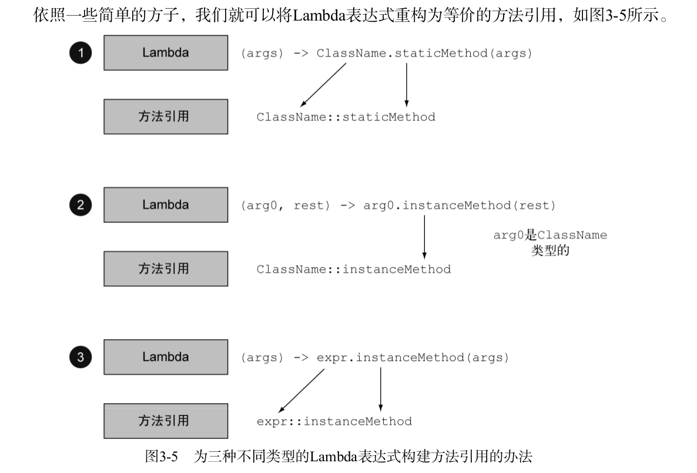

- [chapter 1](#chapter-1)
- [chapter 2](#chapter-2)
- [chapter 3](#chapter-3)
- [chapter 4](#chapter-4)
- [chapter 5](#chapter-5)
- [chapter 6](#chapter-6)
- [chapter 7](#chapter-7)
- [chapter 8](#chapter-8)

### chapter 1
  - 函数式编程的两个核心思想：将方法和Lambda作为一等值,以及在没有可变共享状态时,函数或方法可以有效、安全的并行执行。
### chapter 2
  - 行为参数化，就是一个方法接受多个不同的行为作为参数，并在内部使用他们，完成不同行为的能力。
  - 在java8之前，要将一段代码作为参数传递给方法，可以使用匿名类的方式来减少代码的冗余。
### chapter 3
  - Lambda表达式的基本语法是:   (参数列表) -> 函数主体
    - (parameters) -> expression
    - (parameters) -> {statements;}
  - 函数式接口就是一个`有且仅有一个抽象方法`，但是可以有多个非抽象方法(静态方法和default关键字修饰的默认方法)的接口。
    > 如果接口中声明的是java.lang.Object类中的 public 方法，那么这些方法就不算做是函数式接口的抽象方法。因为任何一个实现该接口的类都会有Object类中公共方法的默认实现。
  - Lambda表达式允许你直接以内联的形式为函数式接口的抽象方法提供实现，并把整个表达式作为函数式接口的实例(具体的说，是函数式接口的一个具体实现的实例)。
  - Lambda表达式可以被赋给一个变量，也可以作为参数传递给一个接受函数式接口作为入参的方法。
  - @FunctionalInterface 注解用于标注接口会被设计成一个函数式接口，虽然他不是必须的，但是推荐使用，这样会在编译期检查使用 @FunctionalInterface 接口是否是一个函数式接口。
  - 关于Java8新引入的几个常用的泛型函数式接口 Predicate、Consumer、Function
  - 如果一个Lambda的主体是一个表达式，它就和一个返回 void 的函数描述符(即函数式接口的抽象方法签名, 例如 `(T, U) -> R`)兼容。下面这个语句是合法的，虽然Lambda主体返回的是List<String>，而不是Consumer上下文要求的 void。
  ```java
     Consumer<String> c = s -> Arrays.asList(s);
  ```
  - Lambda表达式可以没有限制的在其主体中引用实例变量和静态变量，但如果是局部变量，则必须显式的声明为final或只能被赋值一次，才能在Lambda主体中被引用。
  - 方法引用主要有三类
    - 指向静态方法的方法引用，例如 `s -> String.valueOf(s)` 可简写成 `String::valueOf`
    - 指向任意类型的实例方法的方法引用，例如 `(String s) -> s.length()` 可简写成 `String::length` (简单的说，就是你在引用一个对象的方法，而这个对象本身是Lambda的一个入参)
    - 指向Lambda表达式外部的已经存在的对象的实例方法的方法引用，下面的示例很好的展示了如何将 Lambda 重构成对应的方法引用
  ```java
        @Test
        public void test10() {
            Consumer<String> c1 = i -> this.run(i);
            //上面的Lambda表达式可以简写成下面的方法引用，符合方法引用的第三类方式, this引用即所谓的外部对象
            Consumer<String> c2 = this::run;
        }
        
        public void run(String s) {}
  ```
  
  - 关于构造函数引用，下面展示了一个简单易懂的栗子
  ```java
    //无参构造
    Supplier<Apple> c1 = () -> new Apple();
    Supplier<Apple> c2 = Apple::new;
    Apple a1 = c2.get();
    //有参构造
    BiFunction<String, Integer, Apple> f1 = (color, weight) -> new Apple(color, weight);//Lambda表达式
    BiFunction<String, Integer, Apple> f2 = Apple::new;//构造函数引用
    Apple a2 = f2.apply("red", 10);
  ```
  - 关于 Comparator比较器、Predicate谓词、Function函数的组合用法
  ```java
    /**
    * 函数的组合用法
    */
    @Test
    public void test15() {
      Function<String, Integer> f = i -> Integer.valueOf(i);//方法引用写法: Integer::valueOf
      Function<Integer, Apple> g = weight -> new Apple(weight); //构造函数引用写法: Apple::new
      Function<String, Apple> h = f.andThen(g); // andThen()相当于数学上的 g(f(x)) 函数
      Apple apple = h.apply("99"); //result: Apple(color=null, weight=99)
    
      Function<Apple, String> y = Apple::getColor;
      Function<Apple, Integer> z = f.compose(y); // compose()相当于数学上的 f(y(x)) 函数
      Integer result = z.apply(new Apple("red", 78));//会报 java.lang.NumberFormatException: For input string: "red" 异常
    }
    
    /**
    * 谓词的组合用法
    * and和or方法是按照在表达式链中的位置，从左到右确定优先级的，如a.or(b).and(c).or(d) 可以看成 ((a || b) && c) || d
    */
    @Test
    public void test14() {
      Predicate<Apple> p1 = apple -> "green".equals(apple.getColor());
      final Predicate<Apple> negate = p1.negate(); //非
      System.out.println(negate.test(new Apple("green", 98)));// result: false
    
      final Predicate<Apple> and = p1.and(apple -> apple.getWeight() > 150);//与
      System.out.println(and.test(new Apple("green", 140)));//result: false
    
      final Predicate<Apple> or = p1.or(apple -> apple.getWeight() > 150);//或
      System.out.println(or.test(new Apple("blue", 170)));//result: true
    }
    
    /**
    * 比较器组合的用法
    */
    @Test
    public void test13() {
      inventory.sort(Comparator.comparing(Apple::getWeight).reversed());//苹果按重量倒序排序
      System.out.println(inventory);
      //苹果按重量倒序排序，当苹果重量相同时，按颜色升序排序
      inventory.sort(Comparator.comparing(Apple::getWeight).reversed().thenComparing(Apple::getColor));
      System.out.println(inventory);
    }
  ```
  - 为了避免自动装箱操作，Java8对Predicate、Function、Supplier、Consumer等一些通用的函数式接口的原始类型进行了特化，例如: IntFunction
### chapter 4
  - 流使用内部迭代，同一个流只能被消费一次
### chapter 5
  - flatMap()方法会把一个流中的每个值转换成另一个流，然后把所有的流扁平化，连接起来形成一个新的流。
  - 对于findFirst()和findAny()，如果不关心返回的元素是哪个，使用findAny()在并行流时限制更少。
  - 流的归约操作-->reduce()方法
    > 所谓规约操作就是将流中所有元素反复结合起来, 最终得到一个值.
  - 原始类型流特化: IntStream, LongStream, DoubleStream的简单使用以及和Stream流之间的相互转换.
  - 构建流的几种方式
    > 由集合创建流, 根据数值范围创建数值流, 由值创建流, 由数组创建流, 由文件生成流, 由函数生成无限流。
  ```java
    IntStream.rangeClosed(1, 100);//根据数值范围创建数值流
    Stream<String> stream = Stream.of("java8", "盖聂", "少司命");//由值创建流
    int sum = Arrays.stream(new int[]{1, 2, 3, 4}).sum();//由数组创建流
    //由文件生成流 ===>下面示例Files.lines得到一个流,流中的每个元素对应文件中的一行
    try (Stream<String> lines = Files.lines(Paths.get("1.txt"), Charset.defaultCharset())) {
    long count = lines.flatMap(line -> Arrays.stream(line.split(" ")))
            .distinct()
            .count();
    } catch (IOException ex) {
    }
    //由函数生成流: 创建无限流
    Stream.iterate(0, n -> n + 1)
        .limit(10)
        .forEach(System.out::println);
    Stream.iterate(new int[]{0, 1}, arr -> new int[]{arr[1], arr[0] + arr[1]}) //创建一个斐波纳契元祖序列
        .limit(10)
        .forEach(arr -> System.out.println("(" + arr[0] + ", " + arr[1] + ")"));
    Stream.generate(Math::random)
        .limit(5)
        .forEach(System.out::println);
  ```
### chapter 6
  - Collectors类中提供了一些静态工厂方法, 用于流的归约和汇总操作。下面是简单的示例, 类中已经导入了Collectors类中的所有静态方法
  ```java
    Long count = menu.stream().collect(counting());//菜单里有多少种菜
    Optional<Dish> optionalDish = menu.stream().collect(maxBy(comparingInt(Dish::getCalories)));//菜单里热量最高的菜
    menu.stream().collect(summingInt(Dish::getCalories));//菜单列表的总热量
    menu.stream().collect(averagingInt(Dish::getCalories));//菜单列表的热量平均值
    IntSummaryStatistics intSummaryStatistics = menu.stream().collect(summarizingInt(Dish::getCalories));//一次迭代,统计出菜单列表元素个数, 菜肴热量最大值、最小值、平均值、总和
    System.out.println(intSummaryStatistics.toString()); //result: IntSummaryStatistics{count=9, sum=4200, min=120, average=466.666667, max=800}
    
    String names = menu.stream().map(Dish::getName).collect(joining(","));//连接字符串
    menu.stream().collect(reducing(0, Dish::getCalories, Integer::sum));//菜单列表的总热量
  ```
  - 流的分组和分区操作 groupingBy(), partitioningBy()
  ```java
    @Test
    public void test2() {
        //单级分组
        Map<Type, List<Dish>> map1 = menu.stream().collect(groupingBy(Dish::getType));
        //多级分组 result: {FISH={NORMAL=[salmon], DIET=[prawns]}, OTHER={NORMAL=[french fries, pizza], DIET=[rice, season fruit]}, MEAT={NORMAL=[chicken], FAT=[pork, beef]}}
        Map<Type, Map<CaloricLevel, List<Dish>>> map2 = menu.stream().collect(groupingBy(Dish::getType, groupingBy(dish -> {
            if (dish.getCalories() < 400) return DIET;
            else if (dish.getCalories() < 700) return NORMAL;
            else return FAT;
        })));
        //菜单中每种类型的菜肴的数量
        Map<Type, Long> map3 = menu.stream().collect(groupingBy(Dish::getType, counting()));//result: {FISH=2, OTHER=4, MEAT=3}
        //菜单中每种类型热量最高的菜肴
        Map<Type, Optional<Dish>> map4 = menu.stream().collect(groupingBy(Dish::getType, maxBy(comparingInt(Dish::getCalories))));//result:{FISH=Optional[salmon], OTHER=Optional[pizza], MEAT=Optional[pork]}
        //上面分组操作后的Optional<Dish>是一定有值的,所以这个Optional包装没什么意义,可以通过collectingAndThen()方法把Dish直接提取出来
        Map<Type, Dish> map5 = menu.stream().collect(groupingBy(Dish::getType, collectingAndThen(maxBy(comparingInt(Dish::getCalories)), Optional::get)));//result:{FISH=Optional[salmon], OTHER=Optional[pizza], MEAT=Optional[pork]}
        //根据菜肴类型分组,获取所有的菜肴名称 result: {MEAT=[chicken, beef, pork], OTHER=[season fruit, pizza, rice, french fries], FISH=[salmon, prawns]}
        LinkedHashMap<Type, Set<String>> map6 = menu.stream().collect(groupingBy(Dish::getType, LinkedHashMap::new, mapping(Dish::getName, toSet())));
        //在上面的例子中, toSet()方法生成的收集器我们是无法指定Set类型的, 可以使用toCollection()工厂方法来指定集合类型, 比如LInkedHashSet
        LinkedHashMap<Type, LinkedHashSet<String>> menu7 = menu.stream().collect(groupingBy(Dish::getType, LinkedHashMap::new, mapping(Dish::getName, toCollection(LinkedHashSet::new))));
    
        //按菜肴是否素食进行分区 result: {false=[chicken, salmon, prawns, beef, pork], true=[rice, french fries, pizza, season fruit]}
        Map<Boolean, HashSet<Dish>> map9 = menu.stream().collect(partitioningBy(Dish::isVegetarian, toCollection(HashSet::new)));
        //获取素食和非素食中热量最高的菜肴 result: {false=pork, true=pizza}
        Map<Boolean, Dish> map10 = menu.stream().collect(partitioningBy(Dish::isVegetarian, collectingAndThen(maxBy(comparingInt(Dish::getCalories)), Optional::get)));
        //将前20个自然数按质数和非质数分区
        Map<Boolean, List<Integer>> map11 = IntStream.rangeClosed(1, 20).boxed().collect(partitioningBy(this::isPrime));
    }
    
    private boolean isPrime(int candidate) {
        int sqrt = (int) Math.sqrt(candidate);
        return IntStream.rangeClosed(2, sqrt).noneMatch(i -> candidate % i == 0);
    }
  ```
  - 自定义收集器的两种方式
    - 实现Collector接口
    - 使用Stream类的重载方法collect(),这种方式只有`IDENTITY_FINISH`特征(即对结果容器做最终类型转换的finisher()方法返回的是一个恒等函数)的收集器才能使用。
  ```java
    collect(Supplier<R> supplier, BiConsumer<R, ? super T> accumulator, BiConsumer<R, R> combiner)
  ```
### chapter 7
  - 调用流的`sequential()`或`parallel()`方法可以指定流顺序/并行执行，其底层原理就是改变一个`记录是否并行执行的标志的布尔变量`的值来实现的。
  - 并行流内部使用了默认的 ForkJoinPool 分支/合并框架，它默认的线程数就是当前机器的处理器数量，这个值是由`Runtime.getRuntime().availableProcessors()`得到的，可以通过下面的方式改变线程池的大小，但不建议，因为一旦线程数超过了处理器的数量，就可能会引发并发访问的共享资源竞争问题。
  ```java
    System.setProperty("java.util.concurrent.ForkJoinPool.common.parallelism", "128");//全局设置
  ```
  - 通过测试原始迭代、并行流、顺序流的几种方式发现，在某些场景下如果不恰当的使用了并行流，反而会大大降低性能，比如Stream类的iterate()方法生成的流使用并行反而会增加额外开销。
    > 因为每次应用iterate()方法时都要依赖前一次应用的结果，因此无法有效的把流划分为多个小块来并行处理，这里把流标记成并行，实则给原本的顺序处理增加了额外的开销
  - 类似limit和findFirst这种依赖于元素顺序的操作，在并行流上的性能一般会比顺序流差。
  - Spliterator可分迭代器的的工作原理，它定义了并行流要如何的拆分它要遍历的数据源。
### chapter 8
  - 1